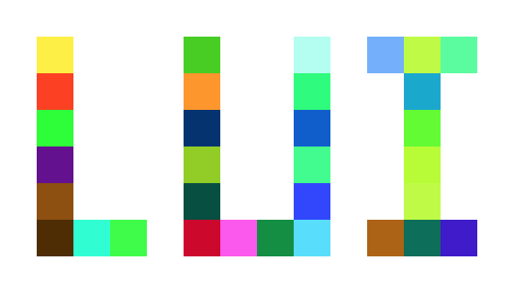

* lui
    * 内存复用
    * 抗锯齿字体
    * 图层控制
    
* Example
```c
    lui_obj_t * icon = lui_create_icon(0,0);
    lui_icon_set_path(icon,LIP_INTERNAL,(char *)desk_jpg);
    lui_obj_add_child(lui_get_root(),icon);

    lui_obj_t * icon2 = lui_create_icon(0,0);
    lui_icon_set_path(icon2,LIP_EXTERNAL,"tool/test.bin");
    lui_obj_add_child(lui_get_root(),icon2);

    lui_obj_t * group = lui_view_group_create(50,50);
    lui_view_group_set_size(group,100,100);
    lui_obj_add_child(lui_get_root(),group);

    lui_obj_t * icon_ba = lui_create_icon(40,0);
    lui_icon_set_path(icon_ba,LIP_EXTERNAL,"tool/battery.png.bin");
    lui_obj_add_child(group,icon_ba);
```
